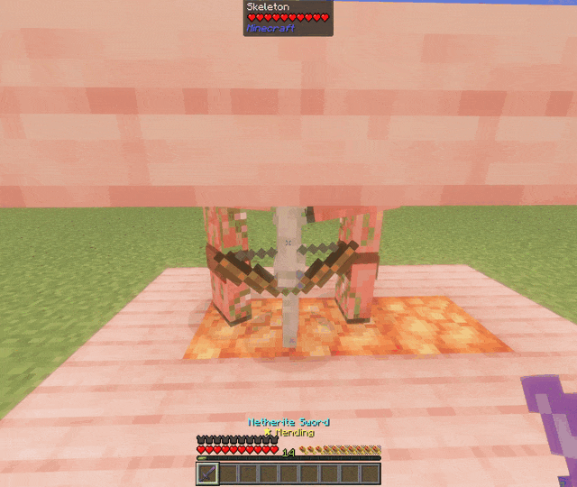
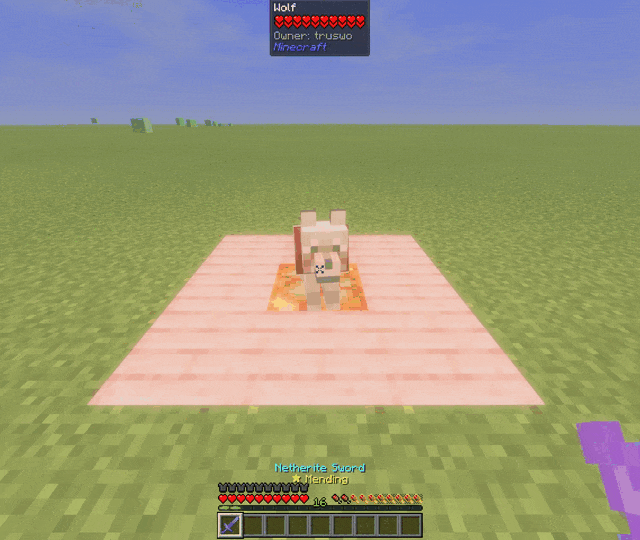

# Accidental Sweep

Prevents you from accidentally attacking the wrong mob when using a sword.

## Overview

It works by making certain mobs invulnerable right before the game does the sweep attack, and making it vulnerable again after it. It's probably not the best way to do it, but it works.
**(This may make mobs outside the list to become invulnerable due to logic errors and may cause some problems with mods that use/modify the invulnerable state)**

It has three different lists based of the [Minecraft Wiki](https://minecraft.wiki/w/Mob#Neutral_mobs)

- passiveMobs and neutralMobs currently act the same way, ignoring sweeping attacks unless the main target is the same mob type as it.

  

- petMobs **require** the player to not be on the ground to attack it, regardless of how the player is attacking it.

  
## Features

- [X] Weapons with sweep attack don't attack neutral/passive mobs when you are attacking a different mob
- [ ] Allows you to add or remove mobs to the mob lists [TODO]
- [ ] Control the mod with Mod Menu [TODO]
- [ ] Support for modded mobs [TODO]
- [ ] Allows you to turn On/Off the mod [TODO]
- [ ] Prevent these mobs from dying in explosions [TODO; not guaranteed]

## Default Lists

| petMobs                           | passiveMobs                    | neutralMobs                       |
|:----------------------------------|:-------------------------------|:----------------------------------|
| entity.minecraft.wolf             | entity.minecraft.allay         | entity.minecraft.bee              |
| entity.minecraft.cat              | entity.minecraft.armadillo     | entity.minecraft.cave_spider      |
| entity.minecraft.parrot           | entity.minecraft.axolotl       | entity.minecraft.dolphin          |
| entity.minecraft.villager         | entity.minecraft.bat           | entity.minecraft.drowned          |
| entity.minecraft.wandering_trader | entity.minecraft.camel         | entity.minecraft.enderman         |
|                                   | entity.minecraft.chicken       | entity.minecraft.fox              |
|                                   | entity.minecraft.cod           | entity.minecraft.goat             |
|                                   | entity.minecraft.copper_golem  | entity.minecraft.iron_golem       |
|                                   | entity.minecraft.cow           | entity.minecraft.llamma           |
|                                   | entity.minecraft.donkey        | entity.minecraft.nautilus         |
|                                   | entity.minecraft.frog          | entity.minecraft.panda            |
|                                   | entity.minecraft.glow_squid    | entity.minecraft.piglin           |
|                                   | entity.minecraft.happy_ghast   | entity.minecraft.polar_bear       |
|                                   | entity.minecraft.horse         | entity.minecraft.pufferfish       |
|                                   | entity.minecraft.mooshroom     | entity.minecraft.trader_llamma    |
|                                   | entity.minecraft.mule          | entity.minecraft.zombie_nautilus  |
|                                   | entity.minecraft.ocelot        | entity.minecraft.zombified_piglin |
|                                   | entity.minecraft.pig           | entity.minecraft.camer_husk       |
|                                   | entity.minecraft.rabbit        | entity.minecraft.skeleton_horse   |
|                                   | entity.minecraft.salmon        | entity.minecraft.zombie_horse     |
|                                   | entity.minecraft.sheep         |                                   |
|                                   | entity.minecraft.sniffer       |                                   |
|                                   | entity.minecraft.snow_golem    |                                   |
|                                   | entity.minecraft.squid         |                                   |
|                                   | entity.minecraft.strider       |                                   |
|                                   | entity.minecraft.tadpole       |                                   |
|                                   | entity.minecraft.tropical_fish |                                   |
|                                   | entity.minecraft.turtle        |                                   |

## Author

- [Lucy (truswo/wzhazy)](https://www.github.com/truswo)
- - [Twitter (@truswo)](https://twitter.com/truswo)
- - [Modrinth (@truswo)](https://modrinth.com/user/truswo)
- - [GitHub (@truswo)](https://github.com/truswo)
